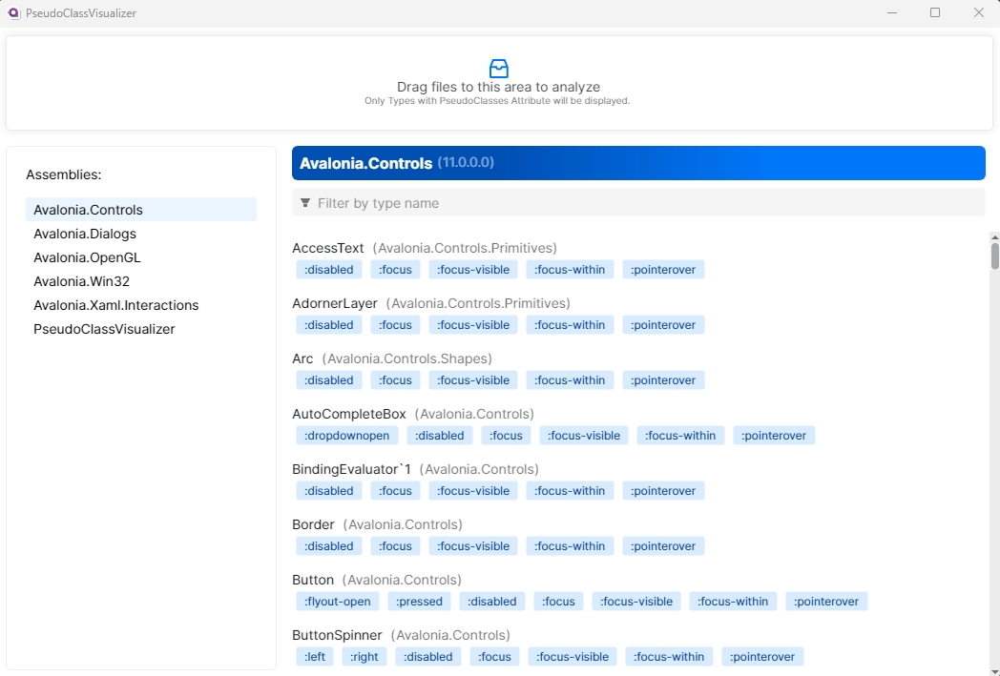

# PseudoClassVisualizer

Visualize Avalonia Control PseudoClasses

### How to use?

1. Drag your control library assembly files to the top area,
2. Select the assembly you want to check
3. You can also filter by control type name. 